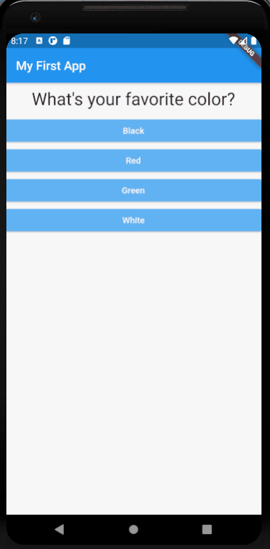

# First_app
This is my first flutter application, it is a really simple app that allows you to select some answers to three questions (but it is easily extendable to more questions) according to your answers the program tells you what kind of person you are, a normal person, a quite strange person or a very strange person.

## Getting Started

To run the code, switch to that example's directory, and use flutter run (you have to have installed flutter on your machine). Make sure you have an emulator running, or a device connected over USB and debugging enabled on that device.

Then in the Command Prompt (CMD):

cd thepath/ofthefolder/of_the_first_app
flutter run

{:height="50%" width="50%"}
